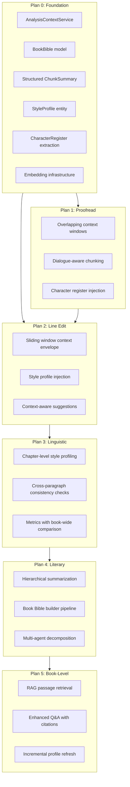

# Analysis Context Enhancement — Master Plan of Plans

## Current State

The analysis system today operates in a relatively "context-blind" way per analysis type:

- **Proofread** chunks text into ~500-word segments with no overlap or surrounding context
- **Line Edit / Linguistic / Literary** send raw scene or chapter text with no book-level context
- **Book-level analyses** use flat chapter summaries via `BookIntelligenceService` + `ChunkSummary`
- `**BookProfile`** exists (genre, synopsis, characters, story structure) but is never injected into chapter/scene-level analysis prompts

Key files that will evolve across all plans:

- [UnifiedAnalysisService.cs](Pagedraft.Api/Services/Analysis/UnifiedAnalysisService.cs) — the single entry point for all analysis
- [PromptFactory.cs](Pagedraft.Api/Services/Ai/PromptFactory.cs) — prompt templates per analysis type
- [BookIntelligenceService.cs](Pagedraft.Api/Services/Analysis/BookIntelligenceService.cs) — chapter summarization and book profile building
- [BookProfile.cs](Pagedraft.Api/Models/BookProfile.cs) / [ChunkSummary.cs](Pagedraft.Api/Models/ChunkSummary.cs) — stored book knowledge
- [AiRouter.cs](Pagedraft.Api/Services/Ai/AiRouter.cs) — model selection and prompt resolution
- [analysis-panel.component.ts](src/app/features/analysis-panel/analysis-panel.component.ts) — client analysis UI

---

## Architecture Overview

---

## Plan 0: Foundation / Shared Context Infrastructure

**Goal:** Build the reusable services, models, and patterns that every subsequent plan depends on. No analysis behavior changes yet — just the plumbing.

### What gets built

**1. `AnalysisContextService`** — a new service that assembles the right context for any analysis call:

- Input: `(scope, targetId, analysisType)`
- Output: an `AnalysisContext` record containing:
  - `TargetText` (the text being analyzed)
  - `PrecedingContext` (previous scene/paragraphs, read-only)
  - `FollowingContext` (next scene/paragraphs, read-only)
  - `CharacterRegister` (active characters with gender, role — for Hebrew gender agreement)
  - `StyleProfile` (author voice summary — tone, POV, tense, vocabulary level, motifs)
  - `ChapterBrief` (structured summary of the chapter)
  - `BookBrief` (compressed book-level context — genre, themes, act summary)

Each field is nullable. The service populates only what exists. Each plan will "turn on" additional fields for its analysis type.

**2. `BookBible` model** — evolution of `BookProfile` into a richer structured entity:

- Add columns: `StyleProfileJson`, `CharacterRegisterJson`, `ThemesJson`, `TimelineJson`, `WorldBuildingJson`
- Keep backward-compatible with existing `BookProfile` fields (genre, synopsis, etc.)
- Alternatively: a new `BookBible` entity with a FK to `BookProfile`, so existing code is untouched

**3. `StructuredChunkSummary`** — upgrade `ChunkSummary.SummaryText` from flat text to structured JSON:

- Fields: `PlotEvents`, `CharacterStates`, `ThematicMarkers`, `ToneNotes`, `OpenThreads`
- Keep `SummaryText` as a backward-compatible flattened version
- Add `StructuredJson` column to `ChunkSummary`

**4. `StyleProfile` entity** — per-book (and optionally per-chapter) style fingerprint:

- `DominantTone`, `POV`, `TensePattern`, `VocabularyLevel`, `DialogueStyle`, `RecurringMotifs`
- Generated once per book, refreshable when chapters change
- Stored as JSON column on `BookBible` or as a separate entity

**5. Embedding infrastructure** (scaffolding only, used in Plan 5):

- Add `sqlite-vec` or a lightweight vector store
- `SceneEmbedding` entity: `(SceneId, ChapterId, BookId, EmbeddingVector, CreatedAt)`
- Embedding generation service using Ollama (`nomic-embed-text` or similar)
- Scaffold the table and service interface; actual population deferred to Plan 5

**6. `PromptFactory` context injection pattern:**

- Extend `PromptFactory` to accept an `AnalysisContext` and weave relevant context fields into the prompt
- Pattern: `[CONTEXT_START]...[CONTEXT_END]` markers so the model knows what is context vs target
- Each analysis type selects which context fields to include

### Key design decisions

- `AnalysisContextService` is the **single point** where context is assembled — `UnifiedAnalysisService` calls it before every analysis, replacing the current `ResolveTarget` method
- Context assembly is **lazy and cached** — if a StyleProfile or ChunkSummary doesn't exist yet, the field is null and the analysis runs without it (graceful degradation)
- All new entities use EF migrations; no hand-written schema changes

---

## Plan 1: Proofread Enhancement

**Goal:** Improve proofread accuracy for Hebrew dialogue and long texts by giving each chunk awareness of its surroundings, without breaking the existing chunked-parallel architecture.

### Changes

**1. Overlapping context windows:**

- Modify `ChunkForProofread` in `UnifiedAnalysisService` to emit an `OverlapPrefix` (last 2-3 sentences of previous chunk) and `OverlapSuffix` (first 2-3 sentences of next chunk)
- Wrap prefix/suffix in prompt markers: `[CONTEXT_BEFORE]...[/CONTEXT_BEFORE]` + `[TEXT_TO_CORRECT]...[/TEXT_TO_CORRECT]`
- Update `ProofreadHe` / `ProofreadEn` prompts to instruct the model: "The text between CONTEXT markers is for reference only — correct only the text between TEXT_TO_CORRECT markers"

**2. Character register pre-pass:**

- Before chunked proofread, call `AnalysisContextService.GetCharacterRegister(chapterId)` 
- If a BookBible with characters exists, extract active characters for this chapter
- If not, run a cheap fast extraction: "List all named characters in this text with their gender" (small LLM call on first ~2000 words)
- Inject as preamble: `דמויות פעילות: רונית (נקבה), אלון (זכר)...`

**3. Dialogue-aware chunking:**

- Detect dialogue blocks (lines starting with `"` or `—` or Hebrew `״`) and avoid splitting mid-conversation
- Prefer chunk boundaries at paragraph breaks between dialogue and narration
- Allow chunks to exceed target by up to 30% to keep dialogue blocks intact

### What it uses from Plan 0

- `AnalysisContextService` for character register lookup
- `PromptFactory` context injection pattern for overlap markers
- `BookBible.CharacterRegisterJson` if available (graceful fallback if not)

---

## Plan 2: Line Edit Enhancement

**Goal:** Make line edit suggestions context-aware — understanding the surrounding narrative flow, the author's established style, and the emotional beat of the scene.

### Changes

**1. Context envelope (sliding window):**

- For scene-scope line edit: `AnalysisContextService` fetches previous scene's last paragraph + next scene's first paragraph
- For chapter-scope: include first/last paragraphs of adjacent chapters
- Injected as `[PRECEDING_CONTEXT]...[/PRECEDING_CONTEXT]` and `[FOLLOWING_CONTEXT]...[/FOLLOWING_CONTEXT]`

**2. Style profile injection:**

- Before running line edit, check if a `StyleProfile` exists for the book
- If yes, inject it into the prompt as a brief preamble: "The author's established style: {tone}, {POV}, {dialogueStyle}..."
- Line edit prompt updated: "Suggestions must preserve the following style characteristics: ..."

**3. Context-aware suggestion categories:**

- Add new categories to line edit output: `"consistency"` (conflicts with established style), `"continuity"` (breaks narrative flow with surrounding context)
- Update `LineEditHe` / `LineEditEn` prompts with the new categories
- Update client `AnalysisSuggestion` interface and `suggestion-card.component.ts` to display new categories

### What it uses from Plan 0

- `AnalysisContextService` for context envelope + style profile
- `StyleProfile` entity (if generated by BookIntelligenceService)
- `PromptFactory` context injection markers

---

## Plan 3: Linguistic Analysis Enhancement

**Goal:** Make linguistic analysis understand the text in the context of the full chapter/book style — comparing register consistency, detecting tone shifts, and benchmarking against the author's own baseline.

### Changes

**1. Chapter-level style profiling:**

- On first linguistic analysis of a chapter, generate and cache a `ChapterStyleProfile` (subset of the book's `StyleProfile` but chapter-specific)
- Compare the target scene's metrics against the chapter baseline
- Add to output: `"deviations"` array — places where the scene diverges from the chapter's established patterns

**2. Cross-paragraph consistency checks:**

- Use context envelope (from Plan 0/2) to detect:
  - Register shifts between paragraphs
  - Tense inconsistencies at scene boundaries
  - POV violations
- Add a `"consistencyIssues"` field to `LinguisticAnalysisResult`

**3. Book-wide metric comparison:**

- If `BookBible.StyleProfileJson` exists, compare the chapter's linguistic metrics against the book-wide averages
- Add to output: "This chapter's average sentence length is 18 words vs. the book average of 12 — consider whether the denser prose serves the scene"

### What it uses from Plan 0

- `AnalysisContextService` (context envelope, style profile, chapter brief)
- `StyleProfile` (book-level and chapter-level)
- `StructuredChunkSummary` for chapter context

---

## Plan 4: Literary Analysis Enhancement

**Goal:** Enable deep literary analysis that understands the full book — character arcs, thematic progression, narrative structure — without stuffing the entire manuscript into context.

### Changes

**1. Hierarchical summarization pipeline:**

- Upgrade `BookIntelligenceService.SummarizeChaptersAsync` to produce `StructuredChunkSummary` (structured JSON instead of flat text)
- Add scene-level summaries (currently only chapter-level exists)
- Add act-level summaries: group chapters into 3-5 acts, summarize each act from chapter summaries
- Store hierarchy: Scene -> Chapter -> Act -> Book

**2. Book Bible builder:**

- New `BookBibleService` that orchestrates:
  - Structured summarization (from step 1)
  - Character extraction + arc tracking across chapters
  - Theme identification + progression tracking
  - Timeline construction
  - Style profile generation
- Runs as a background job (like chunked proofread), triggered when author clicks "Refresh Book Bible" or auto-triggered on chapter save
- Incremental: only re-summarizes chapters that changed since last run

**3. Multi-agent literary analysis:**

- Decompose `LiteraryAnalysis` into specialist sub-analyses:
  - **Character Agent**: BookBible characters + target text -> character voice, consistency, development feedback
  - **Theme Agent**: BookBible themes + target text -> thematic coherence, symbolism, motif feedback
  - **Craft Agent**: StyleProfile + target text -> prose quality, tone, rhetorical devices
- Run in parallel (like chunked proofread), merge results into unified `LiteraryAnalysisResult`
- Expose as a single `LiteraryAnalysis` type to the UI — the multi-agent split is internal

**4. Client: Book Bible panel:**

- New UI section on the book dashboard showing the Book Bible
- Author can view and manually edit character descriptions, theme notes, style notes
- Edits are saved back and used in subsequent analyses

### What it uses from Plan 0

- `BookBible` model (fully populated for the first time)
- `StructuredChunkSummary` (scene + chapter + act levels)
- `StyleProfile`
- `AnalysisContextService` (assembles the right hierarchy level per request)

---

## Plan 5: Book-Level Analyses Enhancement

**Goal:** Make BookOverview, Synopsis, CharacterAnalysis, StoryAnalysis, and Q&A work with full-book fidelity using RAG + the Book Bible built in Plan 4.

### Changes

**1. Embedding / RAG infrastructure (activate):**

- Populate `SceneEmbedding` table: generate embeddings for every scene using local Ollama model
- At analysis time, embed the query/target, retrieve top-K most relevant scenes
- Combine with hierarchical summaries: summaries = global map, RAG = specific relevant passages

**2. Enhanced Q&A:**

- Instead of only using chapter summaries, use RAG to retrieve the actual passages most relevant to the question
- Include retrieved passages as `[RELEVANT_PASSAGES]...[/RELEVANT_PASSAGES]` alongside the chapter summaries
- Improve citation accuracy — cite specific scenes, not just chapters

**3. Enhanced CharacterAnalysis / StoryAnalysis:**

- Use Book Bible as the baseline, then RAG-retrieve scenes where characters appear or plot events occur
- Detect new characters/events not yet in the Book Bible and flag them for update
- Incremental profile refresh: after analysis, offer to update the Book Bible with new findings

**4. Enhanced BookOverview / Synopsis:**

- Use act-level summaries (from Plan 4) for better structural understanding
- Cross-reference with StyleProfile for more nuanced genre/register assessment

**5. Client: enriched book dashboard:**

- Show RAG-retrieved evidence alongside analysis results
- Q&A shows clickable citations that navigate to the actual scene in the editor

### What it uses from Plan 0

- Embedding infrastructure (fully activated)
- `AnalysisContextService` with RAG retrieval
- `BookBible` (as both input and output — analyses can update it)

---

## Dependency Graph (What Builds on What)

## Key Design Principles Across All Plans

- **Graceful degradation:** Every context field is optional. If the Book Bible hasn't been generated yet, analysis runs with whatever context is available (same as today). No plan breaks existing functionality.
- **Incremental enrichment:** Each chapter save can trigger lightweight context updates (re-summarize the changed chapter, invalidate its embedding). Heavy operations (full Book Bible refresh) are explicit user actions.
- **Prompt structure convention:** All plans use the same marker pattern — `[SECTION_NAME]...[/SECTION_NAME]` — so the model always knows what is context vs target text. This is established in Plan 0.
- **Model-agnostic:** Context assembly is done before the `AiRouter`. Any model (Ollama local, OpenAI, Anthropic) receives the same enriched prompt. Model-specific tuning stays in `AiOptions.FeatureModels`.
- **Hebrew-first:** Character register, dialogue detection, and style profiling must all handle Hebrew RTL text, Hebrew dialogue conventions, and Hebrew morphology (gender agreement, construct state, etc.).

