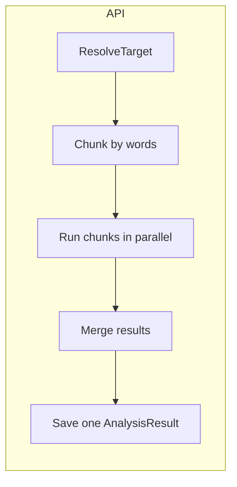

# Chunked Parallel Proofreading Plan

## Goal

Support proofreading chapters of any length by:

- Splitting the chapter into chunks of **~500 words** (configurable), respecting paragraph/sentence boundaries.
- Running proofread on multiple chunks **in parallel** with a configurable cap (e.g. 2–3) to avoid overloading the local machine.
- **Merging** chunk results into one full `resultText` and saving **one** `AnalysisResult`, so the existing client (single diff, suggestion cards, Accept/Dismiss) works unchanged.

## Architecture

- **Non-streaming** (`POST .../analyze` with `stream: false`): use chunking when text exceeds the chunk target (e.g. 500 words).
- **Streaming** (`stream: true`): keep current behavior (single request). Long text continues to hit the existing length limit; users can use non-streaming for long chapters.

## Key files

| Role                                          | File                                                                                                                                                                                |
| --------------------------------------------- | ----------------------------------------------------------------------------------------------------------------------------------------------------------------------------------- |
| Proofread entry point, chunking branch, merge | [Pagedraft.Api/Services/Analysis/UnifiedAnalysisService.cs](c:/Users/tomer/source/repos/PageDraft/src/Pagedraft.Api-repo/Pagedraft.Api/Services/Analysis/UnifiedAnalysisService.cs) |
| Config model                                  | [Pagedraft.Api/Services/Ai/AiOptions.cs](c:/Users/tomer/source/repos/PageDraft/src/Pagedraft.Api-repo/Pagedraft.Api/Services/Ai/AiOptions.cs)                                       |
| Config values                                 | [Pagedraft.Api/appsettings.json](c:/Users/tomer/source/repos/PageDraft/src/Pagedraft.Api-repo/Pagedraft.Api/appsettings.json)                                                       |

## Implementation steps

### 1. Add proofread chunking configuration

- In [AiOptions.cs](c:/Users/tomer/source/repos/PageDraft/src/Pagedraft.Api-repo/Pagedraft.Api-repo/Pagedraft.Api/Services/Ai/AiOptions.cs): add an optional `ProofreadChunking` section (or top-level properties) with:
  - **ChunkTargetWords** (int, default 500): target words per chunk.
  - **MaxParallelChunks** (int, default 2): max concurrent LLM requests for proofread chunks.
- In [appsettings.json](c:/Users/tomer/source/repos/PageDraft/src/Pagedraft.Api-repo/Pagedraft.Api-repo/Pagedraft.Api/appsettings.json): add under `"Ai"` something like `"ProofreadChunkTargetWords": 500`, `"MaxParallelProofreadChunks": 2` (or a nested `ProofreadChunking` object if you prefer).
- Bind and inject these options where needed (e.g. `UnifiedAnalysisService` reads them via `IOptions<AiOptions>` or a dedicated options type).

### 2. Chunking helper (word-based, paragraph/sentence aware)

- Add a static or instance helper that:
  - **Input**: full chapter text, target words per chunk (e.g. 500).
  - **Split** on paragraph boundaries first (e.g. `\n\n` or regex for multiple newlines). Then, if a paragraph group exceeds the target, split on sentence boundaries (e.g. `.` , `।`, `?`, `!` and similar for Hebrew). Goal: no mid-sentence cuts.
  - **Word count**: split on whitespace (`\s+`), count; works for both Hebrew and English.
  - **Output**: ordered list of chunks, each with the **text** to send and the **separator** that followed it in the original (e.g. `"\n\n"`), so merge can reconstruct the full string.
- Place this in `UnifiedAnalysisService` as a private static method, or in a small internal class e.g. `ProofreadChunker`, used only by the service.

### 3. Proofread chunk execution and merge in RunAsync

- In [UnifiedAnalysisService.RunAsync](c:/Users/tomer/source/repos/PageDraft/src/Pagedraft.Api-repo/Pagedraft.Api-repo/Pagedraft.Api/Services/Analysis/UnifiedAnalysisService.cs) (around lines 51–136):
  - After `ResolveTarget`, when `analysisType == AnalysisType.Proofread`:
    - Read chunk target words and max parallel from config (with defaults).
    - **If** word count of `inputText` is **at or below** the target (e.g. ≤500): keep the **current single-request path** (no chunking).
    - **Else**:
      - **Remove** the current `MaxProofreadInputLength` throw for this path (chunking handles long text).
      - Build chunks using the chunking helper.
      - For each chunk, build an `AiRequest` (same instruction, chunk text as `InputText`, same `TaskType`/`Language`/`SourceId`). Call `_router.CompleteAsync(request, ct)` to get the LLM response.
      - Run these requests with **limited parallelism** (e.g. `SemaphoreSlim(MaxParallelChunks)` and `Task.WhenAll`, or `Parallel.ForEachAsync` with `MaxDegreeOfParallelism`). Pass `ct` so cancellation aborts all.
      - Per chunk: apply existing **sanitization** (e.g. `SanitizeResponse`, think-block strip) and **invalid-result** logic (`IsProofreadResultUnrelated`); if invalid or failure, use the **original chunk text** for that segment in the merge.
      - **Merge**: concatenate corrected chunk texts in order, inserting the **stored separator** between consecutive chunks (e.g. `corrected1 + sep1 + corrected2 + sep2 + ...`). Result is one `resultText` for the full chapter.
      - Build **one** `AnalysisResult` with `ResultText = mergedResultText`, same `ChapterId`, `BookId`, `Scope`, `AnalysisType`, etc. Set `ProofreadNoChangesHint` only if the merged result is nearly identical to the full input (reuse `IsProofreadResultNearlyIdentical`).
      - Save that single result and return it.
  - Non-proofread analysis types and the “short text” proofread path stay as they are (single request, no chunking).

### 4. Streaming and length limit behavior

- **Streaming** (`RunStreamingAsync`): do **not** implement chunking. Keep the existing single-request flow and the existing length check (e.g. 10k chars or current behavior). Document or log that for long chapters, non-streaming proofread is recommended (chunked).
- **Non-streaming**: when chunking is enabled and used, the previous “proofread text too long” exception is no longer thrown for that path. Optionally keep a very high character cap as a safety net only (e.g. only for streaming or if config disables chunking).

### 5. Edge cases and logging

- **Empty or whitespace-only chunks**: skip or treat as “use original segment” in merge.
- **Cancellation**: pass `ct` into all chunk tasks so one cancel stops the whole run.
- **Logging**: log chunk count, chunk index when starting/finishing each chunk, and merge length so operators can see chunked runs in traces.

## Client impact

- **None.** The API still returns a single `AnalysisResult` with one `resultText`. The client continues to call `proofreadDiff(documentText, result.resultText)` and shows suggestion cards with Accept/Dismiss; History and Versions remain unchanged.

## Testing suggestions

- Chapter with < 500 words: single request (unchanged behavior).
- Chapter with e.g. 1200 words: 3 chunks, 2 in parallel then 1; merged result length ≈ original; client diff produces sensible suggestions.
- One chunk fails or returns unrelated content: merge uses original text for that chunk; rest of run still applied.
- Cancel during chunked run: all chunk tasks stop; no partial persist (or document intended behavior if you persist partial on cancel).

## Summary

| Item      | Action                                                                                             |
| --------- | -------------------------------------------------------------------------------------------------- |
| Config    | Add `ChunkTargetWords` (500) and `MaxParallelProofreadChunks` (2) under Ai.                        |
| Chunking  | New helper: split by paragraphs/sentences, ~500 words per chunk; output chunks + separators.       |
| RunAsync  | For Proofread and word count > target: chunk → parallel run (capped) → merge → one AnalysisResult. |
| Streaming | No chunking; keep current single-request and length limit.                                         |
| Client    | No changes.                                                                                        |

