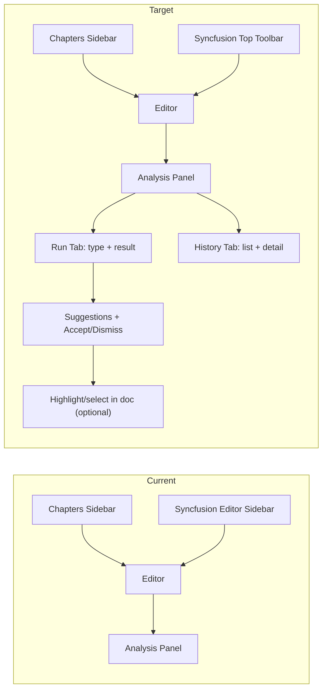

# Document Editor UI Makeover Plan

## Current state (summary)

- **Layout**: Three-column grid in [editor-page.component.ts](c:/Users/tomer/source/repos/PageDraft/src/pagedraft-client/src/app/features/editor/editor-page.component.ts) — left sidebar (240px) with Chapters + Import DOCX + [chapter-tree](c:/Users/tomer/source/repos/PageDraft/src/pagedraft-client/src/app/features/chapter-tree/chapter-tree.component.ts), center editor (Syncfusion), right panel (300px) with tabs Analysis | Language | Book.
- **Analysis panel**: [analysis-panel.component.ts](c:/Users/tomer/source/repos/PageDraft/src/pagedraft-client/src/app/features/analysis-panel/analysis-panel.component.ts) — type picker, Run / Run streaming, then **History** (filter chips + history entry tabs) and **result view** in one vertical flow, so history pushes down the analyze result.
- **Proofread API**: Returns only full corrected text in `resultText` (no structured suggestions). Line Edit returns `structuredResult` with `suggestions[]` (original, suggested, reason, category) and is already rendered as a list in the panel.
- **Apply flow**: [issue-panel](c:/Users/tomer/source/repos/PageDraft/src/pagedraft-client/src/app/features/language-engine/issue-panel.component.ts) emits `ApplyCorrectionEvent` (text, startOffset?, endOffset?); editor applies via [onApplyCorrection](c:/Users/tomer/source/repos/PageDraft/src/pagedraft-client/src/app/features/editor/editor-page.component.ts) using `getTextFromSfdt` / `buildMinimalSfdt` and replace.

---

## 1. Syncfusion document editor: remove sidebar, use top toolbar

**Goal**: The Syncfusion Document Editor component has (or can show) a sidebar for formatting tools. Replace that with Syncfusion’s **top toolbar** so the editor uses a horizontal toolbar above the document instead of a side panel. The **Chapters left sidebar** (chapter tree, Import DOCX) stays unchanged.

**Approach**:

- In [editor-page.component.ts](c:/Users/tomer/source/repos/PageDraft/src/pagedraft-client/src/app/features/editor/editor-page.component.ts), the layout remains: left sidebar (Chapters) + editor area + right panel (Analysis / Language / Book). Only the **Syncfusion Document Editor** configuration changes.
- Configure the Syncfusion `DocumentEditorContainer` (or `DocumentEditor`) so that:
  - The editor’s **sidebar** (if currently visible) is disabled or hidden.
  - The editor’s **toolbar** is shown at the **top** of the editor area (above the document), with the usual formatting options (font, size, bold, italic, etc.). Use Syncfusion’s documented API for “toolbar at top” / “show toolbar” and “hide sidebar” (or equivalent properties).
- No change to the Chapters sidebar, chapter-tree component, or Import DOCX button. No change to grid columns or overall page layout.

**Files to touch**: [editor-page.component.ts](c:/Users/tomer/source/repos/PageDraft/src/pagedraft-client/src/app/features/editor/editor-page.component.ts) (Syncfusion container props/callbacks); optionally Syncfusion Document Editor module configuration or styles if the component exposes toolbar/sidebar via template or options). Refer to Syncfusion Document Editor documentation for the exact property names (e.g. `showToolbar`, `toolbarPosition`, or sidebar visibility).

---

## 2. History in a separate tab so it does not push down analyze text

**Goal**: Prevent the history list from taking vertical space in the same view as the current analysis result, so the “analyze text” / result area is always visible.

**Approach**:

- In [analysis-panel.component.ts](c:/Users/tomer/source/repos/PageDraft/src/pagedraft-client/src/app/features/analysis-panel/analysis-panel.component.ts), split the right-panel content into **two sub-views** (tabs or segments):
  - **Tab 1 — “Run” or “Analysis”**: Type picker, custom prompt (if Custom), Run / Run with streaming, and **only the current/latest result** (or streaming result). No history list here.
  - **Tab 2 — “History”**: History filter chips (All, Proofread, Line Edit, …) and the full list of past runs; selecting an entry shows that run’s result in this tab (or in a detail block below the list).
- So: “Run” tab = run controls + single result area (no history pushing it down). “History” tab = list of past analyses + selected result. Optional: when user runs a new analysis, stay on “Run” tab and show the new result there; when they open “History”, they see the list and can open any past run.
- Layout: use a small tab strip (e.g. “Run” | “History”) at the top of the analysis panel content; keep existing styles and RTL in mind.

**Files to touch**: [analysis-panel.component.ts](c:/Users/tomer/source/repos/PageDraft/src/pagedraft-client/src/app/features/analysis-panel/analysis-panel.component.ts) (template + state for active sub-tab; move history block into History tab only).

---

## 3. Relate analysis results to the main text: suggestions in the document + panel

**Problem**: Proofread returns one corrected paragraph (`resultText`); the only real change might be “sunbeam” → “sunbeams”. That is not tied to the editor text: no highlights, no per-suggestion Accept/Dismiss.

**3a — Visualize problems and fixes in the actual text**

- **Proofread (full-text result)**:
  - **Client-side diff**: After a Proofread run, take the **current document plain text** (from `getTextFromSfdt(serialize())`) and the **resultText** from the API. Use a diff algorithm (e.g. `diff-match-patch` or a small character/word diff) to compute a list of **replacements**: `{ startOffset, endOffset, originalText, suggestedText }`. Normalize whitespace before diffing if needed.
  - Treat each replacement as a **suggestion**: show in the analysis panel as “Original → Suggested” (and optional short reason like “Spelling”) with **Accept** and **Dismiss**.
  - **Accept**: Reuse existing `ApplyCorrectionEvent`: emit `{ text: suggestedText, startOffset, endOffset }` and let the editor’s [onApplyCorrection](c:/Users/tomer/source/repos/PageDraft/src/pagedraft-client/src/app/features/editor/editor-page.component.ts) replace that range (same as issue-panel). After accept, remove that suggestion from the list and optionally re-run diff for the rest.
  - **Dismiss**: Remove from the displayed list only (no document change).
- **Line Edit**: Already has structured `suggestions[]` with original/suggested/reason/category. Add **Accept** (and optionally Dismiss) per item: map “original” to a range in the current document (e.g. by searching for the first occurrence of `original` in the plain text, or by storing offsets if the API ever provides them). On Accept, emit `ApplyCorrectionEvent` with that range and `suggested`. If mapping by search is ambiguous, prefer first match or show a short warning.
- **Unified “suggestions” model**: Introduce a small interface, e.g. `AnalysisSuggestion { startOffset?, endOffset?, original, suggested, reason?, category? }`. Proofread flow produces this from diff; Line Edit from `structuredResult`. The analysis panel (and optionally a shared “suggestions” component) renders a list of these with Accept/Dismiss and, when a suggestion is focused/selected, triggers “highlight in document” (see 3b).

**3b — Highlight relevant text and show comments**

- **In the editor**: Syncfusion Document Editor does not expose a simple “select by character offset” API in the current code. Practical options:
  - **Option A (recommended for v1)**: When the user focuses/clicks a suggestion in the panel, **scroll the editor into view** and, if possible, **select the range** in the document. This may require building a **text offset → SFDT position** map (by walking sections/blocks/inlines and counting characters) and using Syncfusion’s selection API if it supports setting selection by position. If not, at least “scroll to” and show the suggestion text in the panel so the user can manually locate it.
  - **Option B**: Apply a **highlight** (e.g. background color) to the span in the document. That would require mapping offset → SFDT and applying character formatting to that range (more invasive and dependent on Syncfusion’s API for applying format to a range by offset).
- **In the panel**: For each suggestion, show the **excerpt** of the document (e.g. “… afternoon **sunbeam** …” with original bolded/colored) and the suggested fix (“sunbeams”), plus optional short comment/reason. This gives context even without in-document highlight.
- **Grammarly-inspired (concept only)**: Underline or highlight the problematic word in the document and show a small tooltip or sidebar card with suggestion and Accept/Dismiss. Your implementation can use PageDraft’s own colors and layout (top bar, tabs, existing panel) rather than copying Grammarly.

**Files to touch**:

- [analysis-panel.component.ts](c:/Users/tomer/source/repos/PageDraft/src/pagedraft-client/src/app/features/analysis-panel/analysis-panel.component.ts): Add “Suggestions” list for Proofread (from diff) and Line Edit (from structuredResult); Accept/Dismiss; optional “Run” vs “History” tab as above.
- [editor-page.component.ts](c:/Users/tomer/source/repos/PageDraft/src/pagedraft-client/src/app/features/editor/editor-page.component.ts): Keep `onApplyCorrection`; add optional `selectRangeInEditor(startOffset, endOffset)` or `highlightRangeInEditor(startOffset, endOffset)` if Syncfusion supports it (or document as follow-up).
- New (or shared) **suggestion card** component / inline template: original vs suggested, reason, Accept, Dismiss, and optional “Show in document” that triggers scroll/select.
- Client-only diff utility (e.g. `proofreadDiff.ts`) that, given `originalText` and `resultText`, returns `AnalysisSuggestion[]` with offsets. Add dependency (e.g. `diff-match-patch`) if needed.

**API (optional later)**: To avoid client-side diff and ambiguity, the backend could later support returning structured suggestions for Proofread (e.g. same shape as Line Edit). Not required for this makeover.

---

## 4. Grammarly-inspired (concept only; do not copy)

- **Ideas to adopt**: (1) Suggestions tied to specific spans in the document. (2) Clear “original → suggested” with Accept/Dismiss. (3) Highlight or underline the relevant span (or at least scroll-to and select). (4) Comments/reasons next to each suggestion.
- **Do not copy**: No replication of Grammarly’s exact layout, colors, or wording. Keep PageDraft’s top bar, Analysis/Language/Book tabs, and existing design system (e.g. [analysis-panel-ui-design.md](c:/Users/tomer/source/repos/PageDraft/src/.cursor/designs/analysis-panel-ui-design.md)).

---

## 5. Global skills and UI design

- Use [pagedraft-roadmap](c:/Users/tomer/source/repos/PageDraft/src/.cursor/skills/pagedraft-roadmap/SKILL.md) for context: “Editor Enhancements” and “UI/UX Improvements” align with this makeover; preserve paragraph structure when applying corrections is a known limitation.
- Follow [analysis-panel-ui-design.md](c:/Users/tomer/source/repos/PageDraft/src/.cursor/designs/analysis-panel-ui-design.md) for type picker, metric cards, and history filtering; extend it with Run vs History tab and suggestions list with Accept/Dismiss.
- RTL and Hebrew: keep all new strings and layout RTL-friendly.

---

## Implementation order (recommended)

1. **History tab** — Quick win: move history into its own tab in the analysis panel so the result area is never pushed down.
2. **Syncfusion toolbar** — Configure Syncfusion Document Editor to hide its sidebar and use the top toolbar for formatting (Chapters left sidebar unchanged).
3. **Proofread suggestions** — Client-side diff (original vs resultText) → list of suggestions with Accept/Dismiss; wire Accept to `onApplyCorrection`.
4. **Line Edit suggestions** — Add Accept/Dismiss per suggestion (range by search in document text); same apply flow.
5. **Highlight / scroll-to** — Optional: when a suggestion is selected, scroll editor and, if feasible, select the range in the document (or document as future work).

---

## Todos (run in this order)

| #   | Mode                   | Task                                                                                                                                               |
| --- | ---------------------- | -------------------------------------------------------------------------------------------------------------------------------------------------- |
| 1   | **auto**               | History tab — Move history into its own tab in analysis panel (Run / History); result area no longer pushed down.                                  |
| 2   | **more capable model** | Syncfusion toolbar — Remove Syncfusion document editor's sidebar; use Syncfusion's top toolbar for formatting (per Syncfusion DocumentEditor API). |
| 3   | **auto**               | Unified suggestion model + suggestion card component (original/suggested/reason, Accept/Dismiss).                                                  |
| 4   | **auto**               | Proofread suggestions — Client-side diff (original vs resultText), list with Accept/Dismiss, wire Accept to onApplyCorrection.                     |
| 5   | **auto**               | Line Edit suggestions — Accept/Dismiss per suggestion; map original to offset (search), apply via ApplyCorrectionEvent.                            |
| 6   | **more capable model** | Highlight / scroll-to — When suggestion selected, scroll editor and select range in document (offset to SFDT map, Syncfusion selection API).       |

## Diagram (high-level)

---

## Risks and notes

- **Syncfusion**: Mapping plain-text offset to SFDT selection/highlight may not be straightforward; the plan keeps “scroll + optional select” as an enhancement and relies on the panel list + Accept as the main UX.
- **Proofread diff**: Simple character/word diff can be wrong on complex edits; prefer a robust diff library and fallback to “show full result only” if diff is ambiguous.
- **Paragraph structure**: Current `onApplyCorrection` uses `buildMinimalSfdt`, which flattens to one paragraph; roadmap already calls out preserving paragraph structure as future work.

